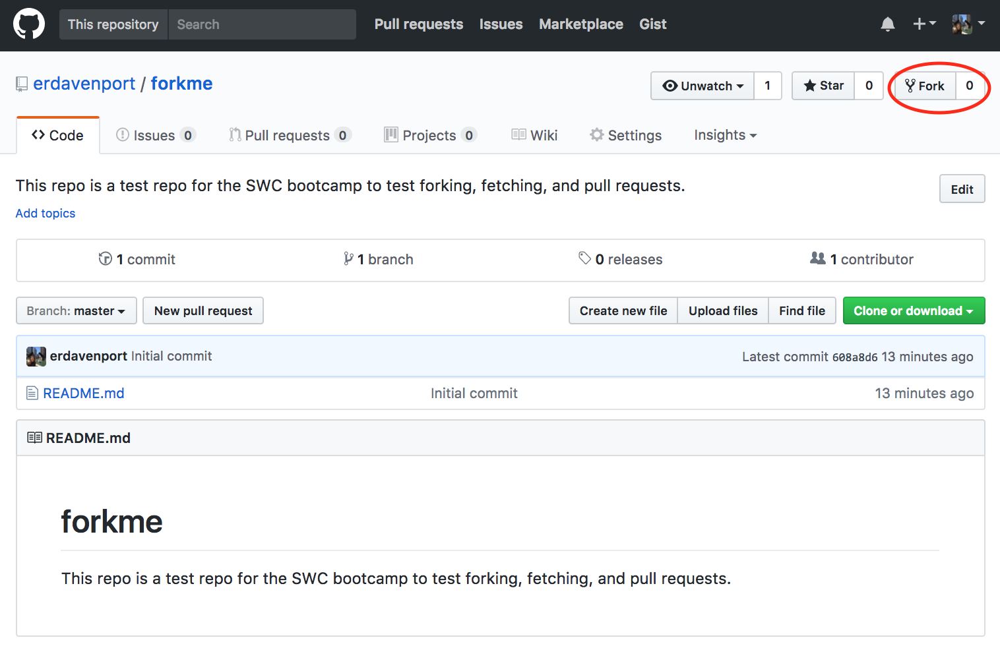
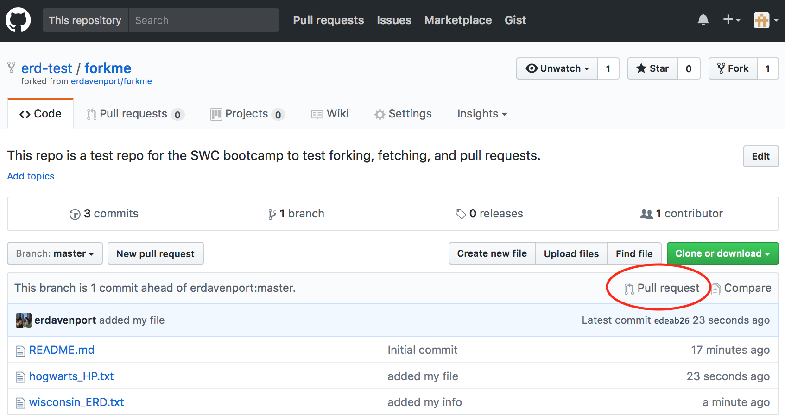

> ## Learning Objectives {.objectives}
>
> *   Learn how to fork, pull upstream changes, and issue pull requests.
> *   Contribute to the repository set up for this workshop.

One of the strengths of using version control is its usefulness for enabling controlled contribution to existing projects. 
What do we mean by controlled contribution? Let's say you notice a typo in someone else's repository. 
Using the tools we'll teach you in this lesson, you'll be able to edit their code and send them those edits, which they can choose to accept or reject.
This gives the owner of the project full control, but there are easy mechanisms for large numbers of people to work on the same code at the same time. 

Let's all collaborate on a single project. 
We want to get a rough sense of where everyone is from who is here for the bootcamp. 
We have a [repo](https://github.com/erdavenport/forkme) set up where we would like you to submit a file that lists either the state you're from (or country if you're international) with your initials (for example: `wisconsin_ERD.txt`). 

The first thing you need to do is navigate to this repo: https://github.com/erdavenport/forkme  

Next, we are going to create a copy of this repository in our own GitHub accounts by clicking the "Fork" button in the upper right and corner of the repo page:

  

Let's clone the repo into our home directory so we can start adding files.
Ensure you clone the version of the repository that is under your username: 

~~~ {.bash}
$ cd 
$ git clone https://github.com/YOUR_USER_NAME/forkme.git
~~~

~~~ {.output}
Cloning into 'forkme'...
remote: Counting objects: 3, done.
remote: Compressing objects: 100% (2/2), done.
remote: Total 3 (delta 0), reused 0 (delta 0), pack-reused 0
Unpacking objects: 100% (3/3), done.
~~~

Let's enter the `forkme` repository and look at the remotes:

~~~ {.bash}
$ cd forkme
$ git remote -v
~~~

~~~ {.output}
origin	https://github.com/erd-test/forkme.git (fetch)
origin	https://github.com/erd-test/forkme.git (push)
~~~

The remotes show a connection to the forked copy of `forkme` that sits in your GitHub account.
However, what if changes happened in the original forkme repository since you've forked it? 
In order to stay up to date with the original repository, we need to set a remote link called `upstream` which links to the original forkme repo:

~~~ {.bash}
$ git remote add upstream https://github.com/erdavenport/forkme.git
$ git remote -v
~~~

~~~ {.output}
origin	https://github.com/erd-test/forkme.git (fetch)
origin	https://github.com/erd-test/forkme.git (push)
upstream	https://github.com/erdavenport/forkme.git (fetch)
upstream	https://github.com/erdavenport/forkme.git (push)
~~~

`upstream` allows us to pull down changes from the original repository.
This will keep us up to date with the current state of the repository. 
We just forked and cloned this repository, so it's unlikely changes have already occurred. 
Regardless, a good practice is to always ensure you are up-to-date with the upstream repo before starting to make changes. 
To do so, we need to `pull`:

~~~ {.bash}
$ git pull upstream master
~~~

~~~ {.output}
From https://github.com/erdavenport/forkme
 * branch            master     -> FETCH_HEAD
Already up-to-date.
~~~

You can see our forked copies were up-to-date with the original repo, and no new files were added. 
I'm going to make a change to this repository and have you re-fetch to demonstrate what happens when there are differences between your local copy and what is upstream.
When I give you the go ahead, run the pull command again:

~~~ {.bash}
$ git pull upstream master
~~~

~~~ {.output}
remote: Counting objects: 3, done.
remote: Compressing objects: 100% (2/2), done.
remote: Total 3 (delta 0), reused 3 (delta 0), pack-reused 0
Unpacking objects: 100% (3/3), done.
From https://github.com/erdavenport/forkme
 * branch            master     -> FETCH_HEAD
Updating 3785f25..146fa46
Fast-forward
 0 files changed
 create mode 100644 wisconsin_ERD.txt
~~~

Now that we know we're up to date with the upstream repo, add your own file to the repository. Add and commit that file locally:  

~~~ {.bash}
$ touch place_initials.txt
$ git add place_initials.txt
$ git commit -m "added my file"
~~~

~~~ {.output}
 0 files changed
 create mode 100644 hogwarts_HP.txt
~~~

Your new file exists in your local repository, but it doesn't exist yet on your repo on GitHub or in the upstream repository. First, let's push these changes to our forkme repository under our GitHub account:

~~~ {.bash}
$ git push origin master
~~~

~~~ {.output}
Counting objects: 6, done.
Delta compression using up to 4 threads.
Compressing objects: 100% (4/4), done.
Writing objects: 100% (5/5), 488 bytes, done.
Total 5 (delta 1), reused 0 (delta 0)
To https://github.com/erd-test/forkme.git
   3785f25..31e7bae  master -> master
~~~

Note that not only was the file we just created pushed to our remote, but also the `wisconsin_ERD.txt` file we had pulled from the upstream earlier.  

We want to make our contribution to the original `forkme` repo.
To do so, we need to issue what's called a pull request in GitHub jargon.
A pull request is just what it sounds like: this is a message from you to the owner of the upstream repository, where you request them to pull your changes.
Pull requests give the owner of the upstream repository control of whether to accept your changes or not.  

Let's issue pull requests of our newly added file, to incorporate that into the original `forkme` repository. 
On GitHub, click the button to the right that says "Pull Requests":

Then click the bright green button that says "New pull request":

Here you'll see a dropdown saying we want to merge the changes from our head fork (`your_user_name/forkme`) to the base fork (`erdavenport/forkme`).
To issue the pull request, click the green "Create pull request button":

It's useful to enter details about why you are requesting the pull request and what you've changed in the next screen. 

Once you've issued the PR, you'll see a screen like what is shown below. 
On this screen, you can enter additional comments to send to the owner (and they can send you comments as well).
Additionally, you can delete the PR if you change your mind about the pull. 

Once you've issued the PR, and email is sent to the owner of the upstream repository. 
Over the next few minutes, I will accept PRs from people in the class.
Look at the repository link to see where everyone is from!

